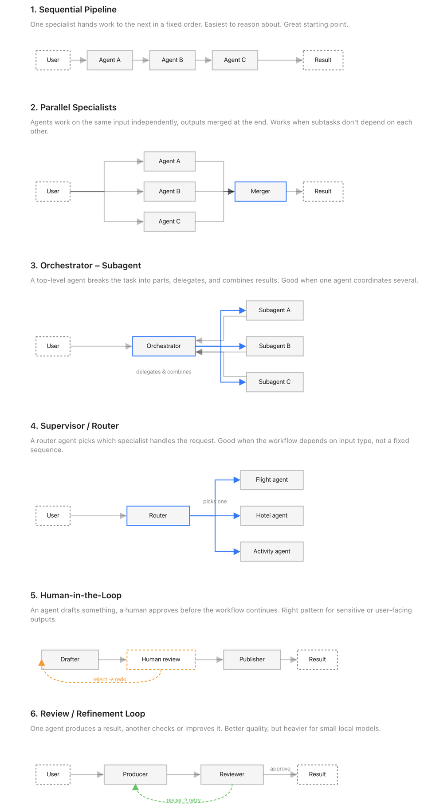

# AI_study_guide
Multi agent/Agentic AI study guide using langgraph

## I. Create a beginner-friendly study guide for this topic:

The output should have exactly these sections:

### 1. Outline
- Break the topic into 3 short study sections

### 2. Notes
- Write short, clear study notes for each section
- Keep the explanations concise and easy to understand

### 3. Review Questions
- Write 3 short review questions based on the notes

Return the result in clean Markdown.

## II. Python + Langchain - study_guide_v1.py.

The Python + Langchain version uses three focused LLM calls or agents (planner, teacher, and quiz writer) coordinated by regular Python code .

The ask() function sends a system prompt and user input to the model and returns the response text. The run_agent() function wraps that call and prints how long each step takes.

Then the code defines three small agents with their own specific prompts:

- planner_agent() creates a 3-part outline for the topic.

- teacher_agent() turns that outline into short beginner-friendly notes.
    
- quiz_agent() creates 3 review questions from the notes.

The build_study_guide() function runs those three agents in sequence, passing each output into the next step.

## III. LangGraph Version with Nodes and Edges
Build the same study note generator with LangGraph. The roles stay the same, but LangGraph provides the orchestration:

- Each specialist becomes a node

- The shared dict becomes graph state

- The execution order becomes edges

Instead of a controller function manually calling agents in sequence, the flow is defined as a graph: 

    START -> planner -> teacher -> quiz -> END.

Each node reads from state and returns only the fields it updates.

## IV. Common Multi-Agent Patterns

Study guide is a sequential pipeline. One specialist hands work to the next in a fixed order. That’s the easiest multi-agent pattern to start with, but it’s not the only one.

A few patterns are worth knowing:

- Parallel Specialists: Multiple agents work on the same input independently and their outputs are merged.

- Orchestrator–Subagent: A top-level agent breaks the task apart, delegates work, and combines results.

- Supervisor / Router: A routing agent decides which specialist should handle the request.

- Human-in-the-loop: An agent drafts the work, but a human reviews or approves it before continuing.

- Review / Refinement loop: One agent produces an output and another checks or improves it.

Source: [ Multi-Agent AI System in Python and LangGraph ](https://www.freecodecamp.org/news/how-to-build-your-first-multi-agent-ai-system-in-python-and-langgraph/)